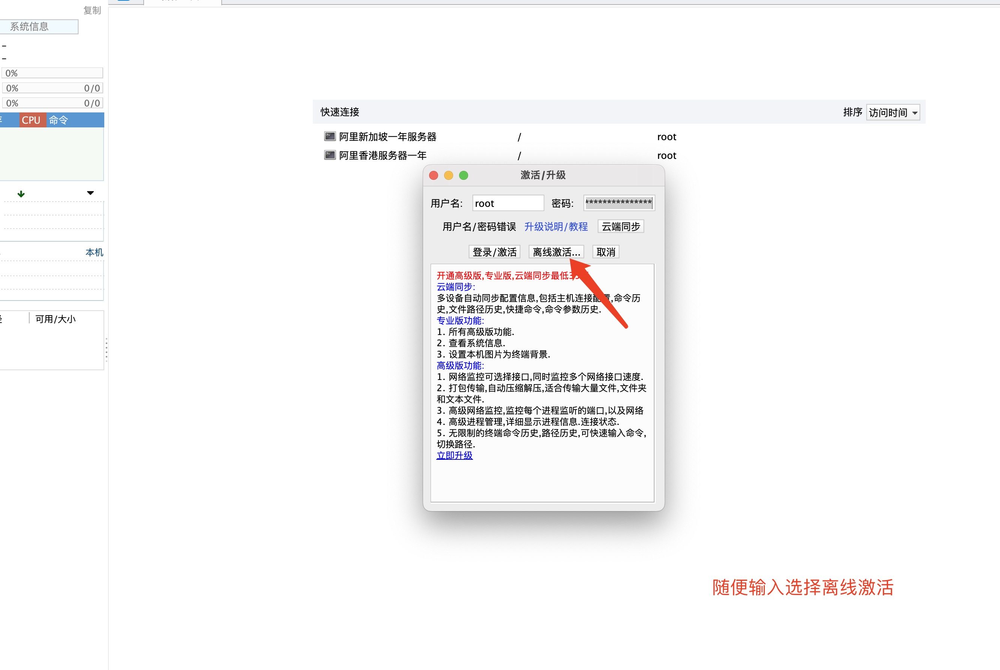
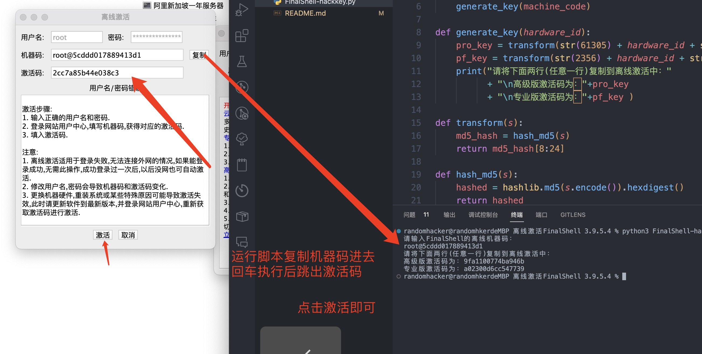
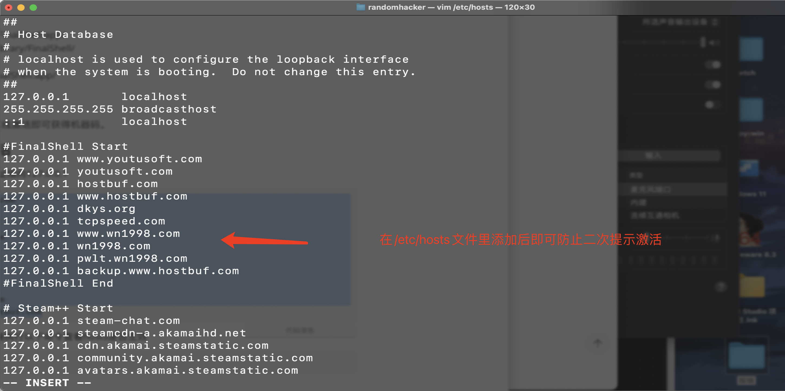

# FinalShell-HackKey

## 相关链接

官网：http://www.hostbuf.com/

激活工具下载：[FinalShell激活脚本(python)](https://github.com/2837164889/FinalShell-HackKey/archive/refs/heads/main.zip)

FinalShell安装包备份：v3.9.5.4，官方2022.6.3发布。

Windows：[OneDrive-2022-8-11-finalshell_install_v3.9.5.4.exe](https://cheshirex-my.sharepoint.com/:u:/g/personal/cheshirex-down_cheshirex_onmicrosoft_com/EXjCgysY6pBJn509TTXm1GUBUzJUqIN6WPjrCqzlQpAJCA?e=Fn4KD7)

macOS：[OneDrive-2022-8-11-finalshell_install_v3.9.5.4.pkg](https://cheshirex-my.sharepoint.com/:u:/g/personal/cheshirex-down_cheshirex_onmicrosoft_com/EWagubjxqM1LqO1q9Q4WFuwBGflZG4SnbPY0FS3vMgAVaQ?e=nEVGMR)

## 相关说明

mac版安装路径 /Applications/FinalShell.app/
配置文件路径 /Users/$USER/Library/FinalShell/
mac版卸载
删除安装目录 /Applications/FinalShell.app/

### 机器码获取

随便输入账号密码，然后选择离线激活即可获得机器码。

### 防止二次打开提示激活

修改本机hosts文件，将下面地址指向127.0.0.1

```
127.0.0.1 www.youtusoft.com
127.0.0.1 youtusoft.com
127.0.0.1 hostbuf.com
127.0.0.1 www.hostbuf.com
127.0.0.1 dkys.org
127.0.0.1 tcpspeed.com
127.0.0.1 www.wn1998.com
127.0.0.1 wn1998.com
127.0.0.1 pwlt.wn1998.com
127.0.0.1 backup.www.hostbuf.com
```

然后使用cmd或者Windows终端执行以下命令查看hosts是否生效

```
ping dkys.org
```

返回地址127.0.0.1即可。

## 相关截图





